<p align="center">
  
</p>

# My take on a TODO app

A simple, yet interesting todo management application built with a React, demonstrating best practices in state management, component architecture, and testing.

## Overview

This application provides a simple solution for managing daily tasks. It showcases a technology stack that includes **React**, **Redux Toolkit** for client state, and **React Query** for server state management.

Key features include **optimistic updates** (with cache cancellation on mutate and invalidation on settle), **Undo** actions for delete/complete, **drag-and-drop** reordering, **persistent state** via localStorage, and a clean, utility-first design system built with Tailwind CSS. The application leverages the **paginated DummyJSON API** to demonstrate infinite scroll handling.

While the DummyJSON API provides endpoints for deleting and editing todos, these are mock endpoints that do not persist data on the server. To create a seamless and realistic user experience, this project introduces a `localStorage` layer to persist all changes locally, making the application feel like a fully-functional todo app.

## Demo & Screenshots

### 🟢 Live Demo

- **CodeSandbox**: [https://856vwd-4173.csb.app/](https://856vwd-4173.csb.app/)

### Application Preview

<p align="center">
  
</p>

### Architecture Overview

The following diagram illustrates the high-level architecture of the application, detailing the flow of data between the UI, state management layers, and the external API.

```mermaid
graph TD
    %% Styling definitions
    classDef browserNode fill:#e3f2fd,stroke:#1976d2,stroke-width:2px,color:#0d47a1,font-weight:bold,font-size:14px
    classDef serviceNode fill:#f3e5f5,stroke:#7b1fa2,stroke-width:2px,color:#4a148c,font-weight:bold,font-size:14px
    classDef backendNode fill:#e8f5e8,stroke:#388e3c,stroke-width:2px,color:#1b5e20,font-weight:bold,font-size:14px

    subgraph "🌐 Browser Environment"
        A["🎨 React UI<br/>Components"]
        B["⚙️ Redux Toolkit<br/>(Client State)"]
        C["🔄 React Query<br/>(Server State & Cache)"]
    end

    subgraph "🔧 Services Layer"
        D["🔌 API Client"]
    end

    subgraph "🖥️ Backend Services"
        E["📡 DummyJSON API"]
    end

    A -- "Dispatches Actions" --> B
    A -- "Uses Hooks" --> C
    B -- "Holds UI State" --> A
    C -- "Provides Server Data" --> A
    C -- "Manages Queries/Mutations" --> D
    D -- "HTTP Requests" --> E

    %% Apply styling
    class A,B,C browserNode
    class D serviceNode
    class E backendNode
```



## Technology Stack

### Core Technologies

- **Frontend Framework**: React 19
- **Build Tool**: Vite 5.3.4
- **Styling**: Tailwind CSS
- **State Management**:
  - **Client State**: Redux Toolkit
  - **Server State**: TanStack Query (React Query)
- **Type System**: TypeScript 5
- **Form Management**: React Hook Form with Zod for validation
- **Animation**: Framer Motion

### Additional Platform Details

- **Validation**: Zod schemas validate API responses (`TodoSchema`, `TodosResponseSchema`).
- **API Client**: Timeout/abort via `AbortController`, exponential backoff retries for GETs, and environment-based base URL.

### Development Tools

- **Testing**: Vitest, React Testing Library
- **Linting**: ESLint, Prettier
- **Package Manager**: npm
- **Version Control**: Git

### Key Architectural Decision

#### **Decision**: LocalStorage for Data Persistence

**Context**: The DummyJSON API used for this project provides mock endpoints for add, update, and delete operations, meaning no changes are persisted on the server. This would result in a disjointed user experience where all changes are lost on page reload.

**Options Considered**: Relying only on the mock API, implementing a custom backend, or using local storage.

**Decision**: A hybrid approach was implemented where the app sends mutation requests to the server for existing todos (for demonstration purposes) while maintaining a `localStorage` persistence layer for all changes. Newly created todos are stored only locally, while updates to existing todos are sent to the server AND stored locally. This provides a fully persistent experience while demonstrating both API integration and local state management.
**Trade-offs**: Data is only stored locally and is not synced across devices. However, this solution provides a significantly improved user experience without the complexity of a full backend.

### Data Persistence Architecture

The diagram below illustrates the hybrid approach where the app sends mutation requests to the server for existing todos while maintaining a localStorage persistence layer for all changes.


#### **Decision**: Search and Filtering Implementation Strategy

**Context**: The project requirements suggest implementing search and filtering as bonus features. However, the chosen approach of using paginated API with infinite scrolling presents significant limitations for implementing these features effectively.

**Options Considered**:

1. Implement search/filtering on fetched items only (limited scope)
2. Modify the API to support search/filtering (not allowed per requirements)
3. Prioritize core functionality and user experience over incomplete features

**Decision**: Strategically chose to prioritize core functionality and smooth user experience over implementing search and filtering features that would not meet user expectations.

**Rationale**:

- **API Limitations**: The DummyJSON API only provides paginated endpoints without search or filtering capabilities. Modifying the API is not an option as per project constraints.
- **User Experience Standards**: Implementing search only on fetched items (current page) would violate user expectations, as users expect to search through their entire todo collection, not just the currently loaded subset.
- **Architectural Integrity**: A proper search implementation would require either:
  - Storing all todos in localStorage (defeating the purpose of pagination)
  - Making multiple API calls to fetch all data for search
- **Strategic Focus**: Instead, the project delivers exceptional user experience through infinite scrolling, optimistic updates, drag-and-drop functionality, and robust state management - features that work seamlessly with the chosen architecture.

This decision aligns with the principle of building features that provide genuine value to users rather than implementing functionality that would create a suboptimal experience.

## Project Structure

```
todo-app/
├── public/                 # Static assets
├── src/
│   ├── app/                # Application-level configuration
│   │   ├── layout.tsx      # Root layout component
│   │   ├── providers.tsx   # Global providers (Redux, React Query)
│   │   ├── store.ts        # Redux store configuration
│   │   ├── index.css       # Global styles
│   │   └── main.tsx        # Application entry point
│   ├── shared/             # Shared utilities and components
│   │   ├── components/     # Reusable UI components
│   │   │   ├── common/     # Common business components
│   │   │   ├── layout/     # Layout-specific components
│   │   │   └── ui/         # Base design system components (Button, Dialog, etc.)
│   │   └── utils/          # Shared utilities and helpers
│   │       ├── apiClient.ts           # API client configuration
│   │       ├── localStorage.ts        # Local storage utilities
│   │       ├── apiErrorHandler.ts     # Error handling utilities
│   │       ├── recalculateLocalDiffs.ts # Data synchronization logic
│   │       └── tailwindUtils.ts       # Tailwind CSS utilities
│   ├── features/           # Feature-based modules
│   │   └── todo/           # Todo feature module
│   │       ├── api/        # Todo-specific API logic
│   │       ├── components/ # Todo-specific components
│   │       │   ├── add/    # Add todo components
│   │       │   ├── edit/   # Edit todo components
│   │       │   ├── item/   # Individual todo item components
│   │       │   ├── list/   # Todo list components
│   │       │   ├── dialogs/ # Todo-related dialogs
│   │       │   └── layout/ # Todo-specific layout components
│   │       ├── hooks/      # Todo-specific custom hooks
│   │       ├── store/      # Todo Redux slice and state management
│   │       └── utils/      # Todo-specific utilities
│   └── App.tsx             # Main application component
├── eslint.config.mjs       # ESLint configuration
├── tailwind.config.js      # Tailwind CSS configuration
├── tsconfig.json           # TypeScript configuration
├── vitest.config.ts        # Vitest configuration
└── vite.config.ts          # Vite configuration
```

### Component Architecture

The component architecture follows a feature-based modular approach, separating concerns between application-level, shared, and feature-specific components.

```mermaid
flowchart TD
    %% Styling definitions
    classDef appNode fill:#e1f5fe,stroke:#0277bd,stroke-width:2px,color:#01579b,font-weight:bold,font-size:14px
    classDef sharedNode fill:#f3e5f5,stroke:#7b1fa2,stroke-width:2px,color:#4a148c,font-weight:bold,font-size:14px
    classDef featureNode fill:#e8f5e8,stroke:#388e3c,stroke-width:2px,color:#1b5e20,font-weight:bold,font-size:14px
    classDef uiNode fill:#fff3e0,stroke:#f57c00,stroke-width:2px,color:#e65100,font-weight:bold,font-size:12px

    subgraph "🚀 Application Level"
        App["📱 App"]
        Layout["🏗️ Layout"]
        Providers["🔧 Providers"]
    end

    subgraph "🔗 Shared Components"
        subgraph "🎨 UI Components (Design System)"
            Button["🔘 Button"]
            Dialog["💬 Dialog"]
            Input["📝 Input"]
            Checkbox["☑️ Checkbox"]
        end
        subgraph "🔄 Common Components"
            CommonUI["🛠️ CommonUI"]
        end
    end

    subgraph "📋 Todo Feature"
        subgraph "🎯 Todo Components"
            TodoList["📜 TodoList"]
            TodoItem["📝 TodoItem"]
            AddTodo["➕ AddTodo"]
            EditTodoForm["✏️ EditTodoForm"]
        end
        subgraph "⚙️ Todo Hooks & Store"
            TodoHooks["🎣 TodoHooks"]
            TodoStore["🏪 TodoStore"]
        end
    end

    %% Connections
    App -- "🏗️ Renders" --> Layout
    Layout -- "🔧 Wraps" --> Providers
    Providers -- "📋 Provides Context" --> TodoList
    TodoList -- "📝 Renders" --> TodoItem
    TodoItem -- "✏️ Opens" --> EditTodoForm
    Layout -- "➕ Renders" --> AddTodo

    EditTodoForm -- "🔘 Uses" --> Button
    EditTodoForm -- "📝 Uses" --> Input
    TodoItem -- "☑️ Uses" --> Checkbox
    TodoItem -- "🔘 Uses" --> Button
    AddTodo -- "🔘 Uses" --> Button
    AddTodo -- "📝 Uses" --> Input

    TodoList -- "🎣 Uses" --> TodoHooks
    TodoItem -- "🏪 Uses" --> TodoStore

    %% Legend
    subgraph "Legend"
        direction LR
        L1(Application Level)
        L2(Shared Components)
        L3(Feature Components)
        L4(UI Design System)
    end

    %% Apply styling
    class App,Layout,Providers appNode
    class CommonUI sharedNode
    class TodoList,TodoItem,AddTodo,EditTodoForm,TodoHooks,TodoStore featureNode
    class Button,Dialog,Input,Checkbox uiNode
    class L1 appNode
    class L2 sharedNode
    class L3 featureNode
    class L4 uiNode
```



## Getting Started

### Prerequisites

- **Node.js**: v18.0.0 or higher
- **npm**: 9.0.0 or higher
- **Git**

### Installation

1. **Clone the repository**

   ```bash
   git clone https://github.com/b-amir/todo-app.git
   cd todo-app
   ```

2. **Install dependencies**

   ```bash
   npm install
   ```

3. **Start the development server**
   ```bash
   npm run dev
   ```
   The application will be available at `http://localhost:5173`.

### Available Scripts

| Command           | Description                                       |
| ----------------- | ------------------------------------------------- |
| `npm run dev`     | Starts the development server with hot reloading. |
| `npm run build`   | Creates an optimized production build.            |
| `npm run preview` | Serves the production build locally for preview.  |
| `npm run test`    | Executes the test suite using Vitest.             |
| `npm run lint`    | Lints the codebase for style and error checking.  |

## Testing

This project uses **Vitest** and **React Testing Library** for comprehensive testing, focusing on user behavior rather than implementation details.

### Testing Approach

- **API Layer**: The `apiClient` is mocked to isolate the data layer from network dependencies, ensuring all CRUD operations and error handling are tested reliably.
- **Component Tests**: Child components and custom hooks are mocked to test each component's logic in isolation. This is applied to critical components like `TodoItem`, `TodoList`, and `AddTodo`.
- **User-Centric Philosophy**: Tests are written to simulate user interactions, ensuring that the application works as expected from the user's perspective.

### Running Tests

```bash
# Run all tests
npm run test

# Run tests in watch mode
npm run test -- --watch

# Run a specific test file
npm run test TodoItem.test.tsx
```

## Deployment

### Build Process

To create a production-ready build, run the following command:

```bash
npm run build
```

This command bundles the application into the `dist/` directory with optimized and minified assets, ready for deployment.

## Contributing

### Code Style Standards

- **ESLint**: Enforced with the `@typescript-eslint/recommended` configuration.
- **Prettier**: Integrated for consistent code formatting.
- **Naming Conventions**: Components in PascalCase, functions in camelCase, and constants in UPPER_SNAKE_CASE.

### Commit Guidelines

This project follows the [Conventional Commits](https://conventionalcommits.org/) specification to maintain a clear and descriptive commit history.

## Troubleshooting

### Common Development Issues

- **Port Already in Use**: If the development server fails to start, the port may be occupied. You can specify a different port:
  ```bash
  npm run dev -- --port 3001
  ```
- **Module Resolution Errors**: If you encounter issues with dependencies, a clean re-installation can often resolve them:
  ```bash
  rm -rf node_modules package-lock.json
  npm install
  ```

## Additional Resources

- **API Documentation**: The application uses the [DummyJSON API](https://dummyjson.com/docs/todos).
- **Framework Documentation**:
  - [React](https://react.dev/)
  - [Redux Toolkit](https://redux-toolkit.js.org/)
  - [TanStack Query](https://tanstack.com/query/latest)
  - [Tailwind CSS](https://tailwindcss.com/)
